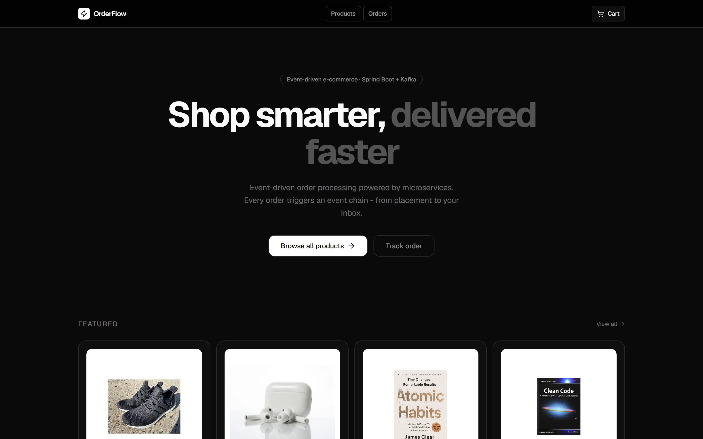
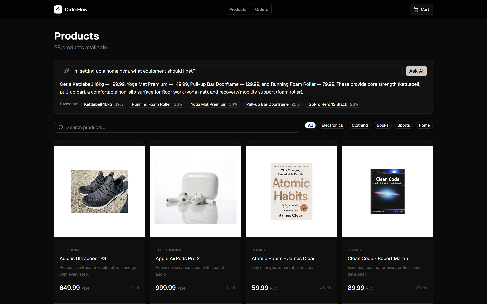
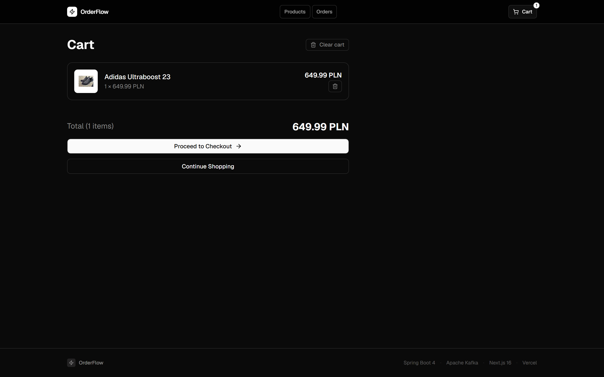
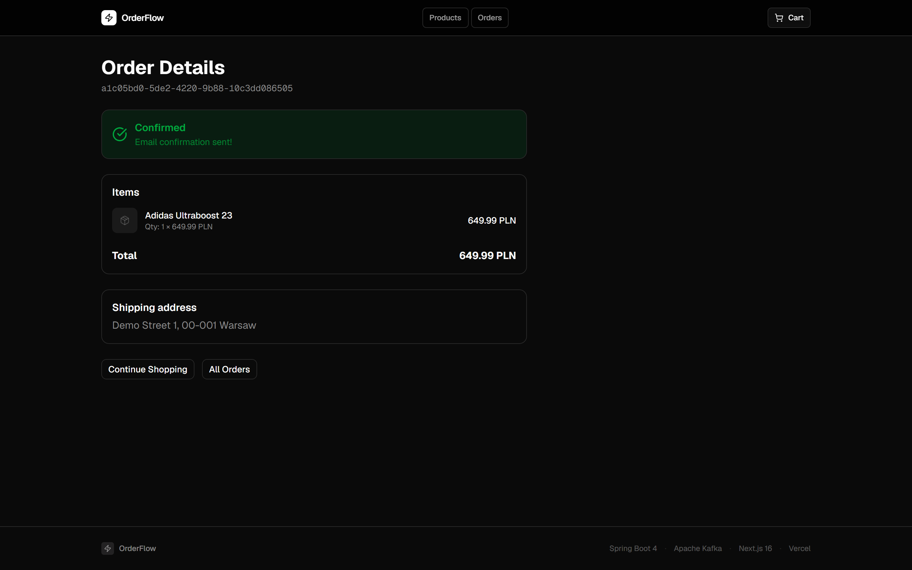

# OrderFlow Frontend

Next.js 16 e-commerce frontend for the OrderFlow microservices platform.

**Live demo:** [orderflow-frontend-five.vercel.app](https://orderflow-frontend-five.vercel.app)

**Backend repository:** [KarimTounsi/orderflow](https://github.com/KarimTounsi/orderflow)

## Features

- **Product catalog** - browse, search, and filter by category (server data cached via React Query)
- **Shopping cart & checkout** - session-based cart, place orders against the order-service
- **Order tracking** - follow an order's status as it moves through the backend saga
- **AI shopping assistant (RAG)** - ask a natural-language question (e.g. *"what should I get for a home gym?"*)
  and get a grounded answer together with the **source products and similarity scores** it was based on.
  The heavy lifting (local ONNX embeddings, pgvector retrieval, LLM generation) runs in the product-service;
  the UI just calls `/search/ask` and renders the answer plus clickable sources. It degrades gracefully -
  if the LLM is disabled the assistant shows a neutral notice and the rest of the shop keeps working.

## Screenshots

| Catalog | AI shopping assistant (RAG) |
|---|---|
|  |  |
| **Cart** | **Order tracking** |
|  |  |

## Tech Stack

- **Next.js 16** - App Router, Server Components, Turbopack
- **React 19** - latest features
- **TypeScript** - strict mode
- **Tailwind CSS v4** - utility-first styling
- **shadcn/ui** - accessible UI components
- **Motion** - animations
- **React Query** - server state management
- **Axios** - HTTP client

## Getting Started

```bash
pnpm install
pnpm dev
```

Open [http://localhost:3000](http://localhost:3000)

## Environment Variables

Copy `.env.example` to `.env.local` and set the backend URLs:

```bash
cp .env.example .env.local
```

```env
NEXT_PUBLIC_PRODUCT_API_URL=http://localhost:8081
NEXT_PUBLIC_ORDER_API_URL=http://localhost:8082
```

In **production** the HTTPS frontend must reach an HTTP backend without mixed-content, so requests
are proxied server-side (`next.config.ts` rewrites). The public vars point at same-origin proxy
paths and the real backend URLs stay server-only:

```env
NEXT_PUBLIC_PRODUCT_API_URL=/proxy/product
NEXT_PUBLIC_ORDER_API_URL=/proxy/order
PRODUCT_BACKEND_URL=http://<backend-host>:8081
ORDER_BACKEND_URL=http://<backend-host>:8082
```

## Backend Services

This frontend requires the following services running:

| Service | Port | Description |
|---|---|---|
| product-service | 8081 | Products catalog, shopping cart (Redis) |
| order-service | 8082 | Orders, checkout |
| fulfillment-service | 8083 | Email notifications (internal) |

Start all services via Docker Compose in the backend repo:

```bash
docker compose up -d
```

## Project Structure

```
src/
├── app/                  # Next.js App Router pages
│   └── (shop)/           # Route group - e-commerce pages
│       ├── products/     # Product catalog
│       ├── cart/         # Shopping cart
│       ├── checkout/     # Order placement
│       └── orders/       # Order tracking
├── components/           # React components
│   ├── ui/               # shadcn/ui primitives
│   ├── layout/           # Navbar, Footer
│   ├── products/         # Product cards, grid, filters
│   ├── search/           # AI shopping assistant (RAG) - question box, answer, sources
│   ├── cart/             # Cart drawer, items
│   ├── checkout/         # Checkout form
│   └── orders/           # Order status, tracking
├── lib/
│   ├── api/              # API clients (product, order, search/RAG)
│   └── session.ts        # Session ID management
├── hooks/                # Custom React hooks
└── types/                # TypeScript interfaces
```

## Deployment

Deployed on [Vercel](https://vercel.com) - live at [orderflow-frontend-five.vercel.app](https://orderflow-frontend-five.vercel.app). Set the environment variables above in the Vercel dashboard. The `next.config.ts` rewrites proxy `/proxy/*` to the backend server-side, so the HTTPS frontend reaches the HTTP backend without mixed-content or CORS.

## Testing

End-to-end tests live in `e2e/` and run with Playwright:

```bash
pnpm exec playwright test
```

These are **smoke tests** - they drive the main user flows (catalog, cart, checkout, AI assistant) and stay tolerant when the backend is unavailable, so they run quickly without the full stack. A stricter checkout-flow test that requires a live backend is a natural next step.
